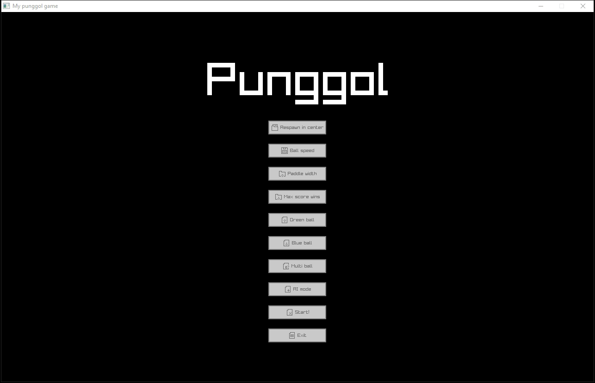

# punggol

A pong game.



## Pre-requisites

### Tools required

- MinGW build tools (contains gcc, g++ etc)
- Make
- CMake
- raylib
- Just
- Windows
- PowerShell

On Windows, Make, CMake and Just can be installed from [scoop](https://scoop.sh/).

```
scoop install make cmake
scoop install main/just
```

### Setup raylib

raylib is required to build this project. Start off by cloning both `raylib` and `raygui` into anywhere on your system.

```
git clone https://github.com/raysan5/raylib
git clone https://github.com/raysan5/raygui
```

After that, change directory into `raylib/src`.

```
cd raylib/src
```

Run the `make` command to build the artifacts.

```
make
```

You should see a file named `libraylib.a` appeared in the directory. That's all you need to do.

## Installation

Clone this repository locally.

```
git clone https://github.com/data-miner00/punggol.git
```

Go to `CMakeLists.txt` and update the path to raylib and raygui. Note that it needs to be at the `/src` subdirectory that contains the header files and the library file.

```
set(RAYLIB_PATH "<my-base-path>/raylib/src")
set(RAYGUI_PATH "<my-base-path>/raygui/src")
```

Create a build directory for store the artifacts generated by cmake.

```
mkdir build && cd build
```

Link the CMake file.

```
cmake ..
```

Build the artifacts.

```
cmake --build .
```

At this point, there should be a file named `punggol.exe`

Simply run the file to see it in action.

```
./punggol.exe
```

For convenience, I have utilized the `just` command runner to automate the build process. You can simply run the following command to build the project easily. Run these commands on the root directory, no need to cd into the `build` directory.

1. `just build` - Build the project
2. `just run` - Run the project
3. `just clean` - Clean the project build folder
4. `just` - Build and run the project

Furthermore, if you use Neovim with clangd as the lsp, you can copy the `compile_commands.json` file to the root or create a symlink.

```
cp compile_commands.json ..
```

## Resources

- [Pong Game with C++ and Raylib - Beginner Tutorial](https://www.youtube.com/watch?v=VLJlTaFvHo4)
